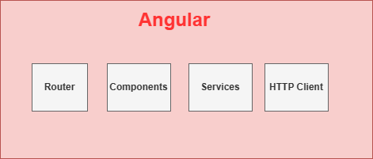
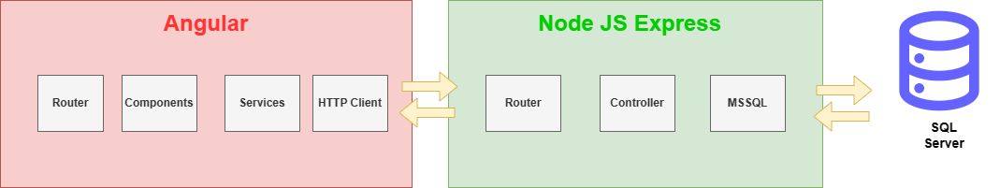

# FrontPruebaSerie

Este repositorio corresponde a la parte visual Front-end de la prueba tecnica agenda de contacto.

**Evidencia Funcionalidad:** https://www.youtube.com/watch?v=feRjORYGb_A

**Enunciado:** se desea crear una agenda personal. Debe permitirse registrar
contactos, incluyendo el nombre completo, el número de documento, la
dirección, número telefónico de contacto, dirección de correo electrónico.
Aclárese que debe permitirse el registro de más de un número telefónico, así
como más de una dirección de correo electrónico. Debe poderse listar los
contactos con su información completa, así como permitirse la modificación y
eliminación de estos.

## Stack Tecnologico

Este projecto esta desarrollado con las siguietes tecnologias: 
[Node.js](https://nodejs.org/)
[Angular CLI](https://github.com/angular/angular-cli) version 16.2.4.
[Boostrap](https://getbootstrap.com/docs/5.0/getting-started/introduction/) version 5.0.3

## Variables de Entorno

```shell
# No se definio variable de entorno
```

## Ejecucion Proyecto

Acontinuacion detallremos las instrucciones para la ejecucion del proyecto.

### Paso a Paso

**Instala las Dependencias:**

Ejecuta el siguiente comando para instalar todas las dependencias del proyecto:

```shell
npm install
```

**Arranca el Servidor de Desarrollo:**

Para iniciar un servidor de desarrollo y ver tu aplicación en el navegador, ejecuta el siguiente comando:

```shell
npm serve -o
```


### Development server

Run `ng serve` for a dev server. Navigate to `http://localhost:4200/`. The application will automatically reload if you change any of the source files.

### Code scaffolding

Run `ng generate component component-name` to generate a new component. You can also use `ng generate directive|pipe|service|class|guard|interface|enum|module`.

### Build

Run `ng build` to build the project. The build artifacts will be stored in the `dist/` directory.

### Running unit tests

Run `ng test` to execute the unit tests via [Karma](https://karma-runner.github.io).

### Running end-to-end tests

Run `ng e2e` to execute the end-to-end tests via a platform of your choice. To use this command, you need to first add a package that implements end-to-end testing capabilities.

### Further help

To get more help on the Angular CLI use `ng help` or go check out the [Angular CLI Overview and Command Reference](https://angular.io/cli) page.

## Estructura Empleada
A continuacion detallamos la estructura empleada que corresponde al freamwork Angular.



Adicional a esto, este front-end junto al repositorio de [back-end](https://github.com/josemasster/PruebaTecnica-Backend) conforman la solución de la prueba.

A continuacion se muestra la arquitectura global


